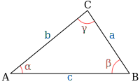

# ayudantia-03

martes 28 marzo 2023

## resumen de fórmulas

## ejercicio-01: diseñando una mesa redonda

quiero diseñar una mesa redonda para 6 personas. estimo que una persona ocupa un espacio de al menos $80(cm)$

- ¿cuál es el perímetro que debe tener la mesa para albergar 6 personas?
- ¿qué radio y diámetro debe tener?
- quiero pintar cada sector individual de la mesa con colores distintos ¿qué ángulo debo formar para dividir la mesa en 6 partes iguales?

--- solución ---

el perímetro sería 6 veces el espacio estimado por persona:

$$p = 6 \cdot 80(cm) = 480(cm) = 4.8(m)$$

el radio lo podemos calcular usando la relación fundamental de $\pi$:

$$\pi = \frac{perímetro}{diámetro} = \frac{p}{2r}$$

$$\therefore \ p = 2 \pi r$$

en el punto anterior calculamos que $p=480(cm)$, por lo que podemos calcular el radio:

$$r=\frac{p}{2\pi}=\frac{480(cm)}{2\pi} \approx 76.4(cm)$$

el diámetro es el doble del radio:

$$d=2r \approx 2\cdot 76.4(cm) \approx 152.8(cm)$$

si se quiere dividir la mesa en 6 partes iguales, debemos dividir los $360°$ totales en 6.

$$ \alpha = 360°/6 = 60° $$

por lo que es necesario que dibujar ángulos de 60° grados.

## ejercicio-02: diseñando una rampa

necesito construir una rampa provisoria para poder llevar a un amigo que usa silla de ruedas hacia adentro de mi casa. compraré una madera gruesa para hacer la rampa.

mi amigo me dice que las rampas no deben tener más de $10°$ de inclinación, si no, pueden ser peligrosas.

la entrada de mi casa tiene una altura de 50 centrímetros. 

¿de qué largo debo comprar la madera para no sobrepasar los $10°$ de inclinación?

¿qué espacio del patio debo desocupar para poner la rampa?

--- solución ---

la rampa para entrar a la casa generará un triángulo rectángulo con uno de los lados de $50cm$ y un ángulo de $10°$.

usando la relación trigonométrica del seno del ángulo:

$$sin(x) = \frac{cateto_{opuesto}}{hipotenusa}$$

$$sin(x) = \frac{b}{c}$$

$$sin(10°) = \frac{50(cm)}{c}$$

$$c = \frac{50(cm)}{sin(10°)}$$

$$c \approx 287.94(cm)$$ 

$$c \approx 2.88(m) $$ 

por lo tanto debo comprar una madera de un largo mayor a $2.88(m)$ para no sobrepasar los $10°$ de inclinación.

--- OJO --- al usar la calculadora para obetener el valor de $sin(10°)$ es necesario asegurar que la calculadora esté en modo 'deg' (grados) y no en modo 'rad' (radianes).

para calcular el espacio del patio que debo desocupar para poner la rampa tenemos dos opciones:

opción 1: 

ya tenemos dos lados del triángulo así que es posible utlizar el teorema de pitágoras para calcular el lado que nos falta.

$$a^2+b^2=c^2$$

$$a = \sqrt{c^2-b^2}$$

$$a = \sqrt{287.94(cm)^2 - 50(cm)^2}$$

$$a \approx 283.56(cm)$$

$$a \approx 2.84(m)$$

opción 2: 

es posible utilizar la relación trigonométrica de la tangente del ángulo:

$$tan(x) = \frac{cateto_{opuesto}}{cateto_{adyacente}}$$

$$tan(x) = \frac{b}{a}$$

$$tan(10°) = \frac{50(cm)}{a}$$

$$a = \frac{50(cm)}{tan(10°)}$$

$$c \approx 283.56(cm)$$ 

$$c \approx 2.84(m) $$ 

## ejercicio-03: triángulos arbitrarios

Dato: https://www.calkoo.com/es/calculadora-de-triangulos

considerando el triángulo de la figura anterior, calcule:

1. si $a=8$, $b=9$ y $\gamma = 50°$ ¿Cuál es la longitud de $c$? ¿Cuánto valen $\alpha$ y $\beta$?

    

    
--- solución ---

    usando el teorema del coseno:

    $$a^2 + b^2 = c^2 + 2ab\cdot cos(\gamma)$$

    $$8^2 + 9^2 = c^2 + 2 \cdot 8 \cdot 9 \cdot cos(50°)$$

    $$145 = c^2 + 144 \cdot cos(50°)$$

    $$c = \sqrt{145 - 144 \cdot cos(50°)}$$

    $$c = 7.24$$

    

2. si $\alpha = 30°$, $\beta = 70°$ y $c = 10$ ¿Cuánto vale $\gamma$? ¿Cuál es la longitud de $a$ y $b$?

    

    
--- solución ---

    para calcular $\gamma$ podemos usar el hecho de que en todos los triángulos los ángulos suman $180°$:

    $$\alpha + \beta + \gamma = 180°$$

    $$30° + 70° + \gamma = 180°$$

    $$\gamma = 180° - 30° - 70°$$

    $$\gamma = 80°$$

    para calcular los lados del triángulo podemos usar el teorema del seno:

    $$\frac{a}{sin(\alpha)} = \frac{b}{sin(\beta)} = \frac{c}{sin(\gamma)}$$

    para calcular $a$:

    $$\frac{a}{sin(\alpha)} = \frac{c}{sin(\gamma)}$$

    $$\frac{a}{sin(30°)} = \frac{10}{sin(80°)}$$

    $$a = 10 \cdot \frac{sin(30°)}{sin(80°)}$$

    $$a = 5.077$$

    para calcular $b$:

    $$\frac{b}{sin(\beta)} = \frac{c}{sin(\gamma)}$$

    $$\frac{b}{sin(70°)} = \frac{10}{sin(80°)}$$

    $$b = 10 \cdot \frac{sin(70°)}{sin(80°)}$$

    $$b = 9.54$$

    

3. si $c=5$, $a=3$ y $\beta = 26°$ ¿Cuál es la longitud de $c$? ¿Cuánto valen $\alpha$ y $\beta$?

    

    
--- solución ---

    usando el teorema del coseno:

    $$a^2 + c^2 = b^2 + 2ac\cdot cos(\beta)$$

    $$3^2 + 5^2 = b^2 + 2 \cdot 3 \cdot 5 \cdot cos(26°)$$

    $$9 + 25 = b^2 + 30 \cdot cos(26°)$$

    $$34 = b^2 + 30 \cdot cos(26°)$$

    $$c = \sqrt{34 - 30 \cdot cos(26°)}$$

    $$c = 2.65$$

    

4. si $a=7$, $b=8$, $c=6$ ¿cuánto vale el ángulo $\alpha$ de éste triángulo?

    

    
--- solución ---

    para esto podemos usar el teorema del coseno

    $$b^2+c^2=a^2+2 \cdot b \cdot c \cdot cos(\alpha)$$

    $$8^2+6^2=7^2+2 \cdot 8 \cdot 6 \cdot cos(\alpha)$$

    $$64+36=49+96 \cdot cos(\alpha)$$

    $$\frac{64+36-49}{96}= cos(\alpha)$$

    $$ cos(\alpha) = \frac{64+36-49}{96}$$

    $$ cos(\alpha) = \frac{51}{96}$$

    $$\alpha = cos^{-1}(\frac{51}{96})$$

    $$\alpha = sec(\frac{51}{96})$$

    $$\alpha = 1.01072 \ (rad)$$

    $$\alpha = 57.91°$$

    

