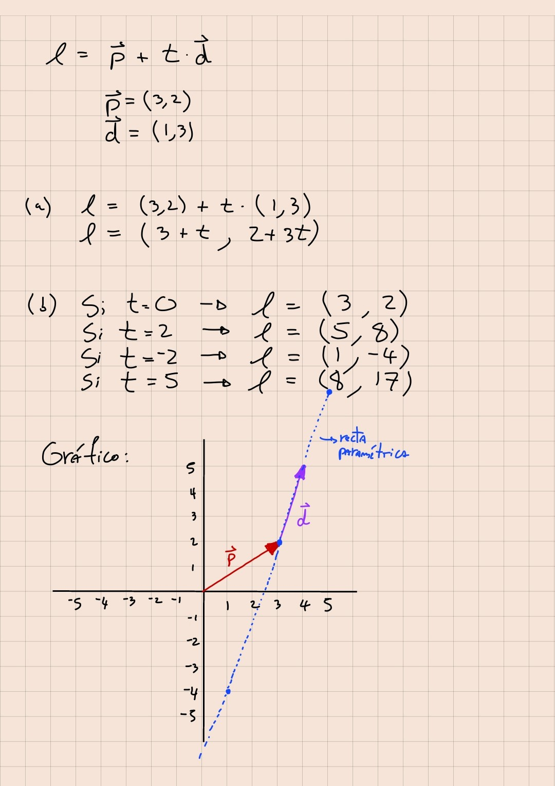

# ayudantia-04

martes 11 abril 2023

## ejercicio-01: diseñando una mesa redonda

quiero diseñar una mesa redonda para 6 personas. estimo que una persona ocupa un espacio de al menos $80(cm)$

- ¿cuál es el perímetro que debe tener la mesa para albergar 6 personas?
- ¿qué radio y diámetro debe tener?
- quiero pintar cada sector individual de la mesa con colores distintos ¿qué ángulo debo formar para dividir la mesa en 6 partes iguales?

--- solución ---

el perímetro sería 6 veces el espacio estimado por persona:

$$p = 6 \cdot 80(cm) = 480(cm) = 4.8(m)$$

el radio lo podemos calcular usando la relación fundamental de $\pi$:

$$\pi = \frac{perímetro}{diámetro} = \frac{p}{2r}$$

$$\therefore \ p = 2 \pi r$$

en el punto anterior calculamos que $p=480(cm)$, por lo que podemos calcular el radio:

$$r=\frac{p}{2\pi}=\frac{480(cm)}{2\pi} \approx 76.4(cm)$$

el diámetro es el doble del radio:

$$d=2r \approx 2\cdot 76.4(cm) \approx 152.8(cm)$$

si se quiere dividir la mesa en 6 partes iguales, debemos dividir los $360°$ totales en 6.

$$\alpha = 360°/6 = 60°$$

por lo que es necesario que dibujar ángulos de 60° grados.

## ejercicio-02: operaciones vectoriales

teniendo los vectores:

$$\vec{a} = (2,5)$$

$$\vec{b} = (1,-2)$$

a) dibuje los vectores $\vec{a}$ y $\vec{b}$ en el plano cartesiano.

b) dibuje los vectores $(-\vec{a})$ y $(-\vec{b})$ en el plano cartesiano.

c) calcule $\vec{a} + \vec{b}$ y dibújelo en el plano cartesiano.

d) calcule $\vec{a} - \vec{b}$ y dibújelo en el plano cartesiano.

e) calcule $\vec{b} - \vec{a}$ y dibújelo en el plano cartesiano.

f) calcule la magnitud de cada vector $\vert \vert \vec{a} \vert \vert$ y $\vert \vert \vec{b} \vert \vert$.

g) calcule el vector unitario $\hat{a}$ y dibújelo en el plano cartesiano.

h) calcule el vector unitario $\hat{b}$ y dibújelo en el plano cartesiano.

i) calcule el vector $\vec{c} = 3 \hat{a}$ y dibújelo en el plano cartesiano.

j) calcule el vector $\vec{d} = -2 \hat{b}$ y dibújelo en el plano cartesiano.

k) calcule el producto punto $\vec{a} \cdot \vec{b}$

## ejercicio-03: suma de vectores

teniendo los vectores:

$$\vec{a} = (2,5)$$

$$\vec{b} = (-3,1)$$

$$\vec{a} + \vec{b} + \vec{c} = (1,-2)$$

a) ¿Cuánto vale $\vec{c}$?

b) Dibuje los vectores $\vec{a}$, $\vec{b}$ y $\vec{c}$ en el plano cartesiano.

c) Dibuje paso a paso la suma vectorial $\vec{a} + \vec{b} + \vec{c}$.

## ejercicio-04: recta paramétrica

teniendo la recta paramétrica $\ell = \vec{p} + t \vec{d}$.

a) calcule la recta $\ell$ descrita por los vectores $\vec{p} = (3,2)$ y $\vec{d} = (1,3)$

b) calcule 4 puntos distintos para esta recta con $t=0$, $t=2$, $t=-2$, $t=5$.

c) dibuje el vector $\vec{p}$ en el plano cartesiano

d) dibuje el vector $\vec{d}$ en el plano cartesiano sobre el vector $\vec{p}$ que acaba de dibujar.

e) marque en el plano cartesiano los 4 puntos $t=0$, $t=2$, $t=-2$, $t=5$ que calculó en el punto (b) de este ejercicio.

f) dibuje la recta $\ell$ en el plano cartesiano.

## ejercicio-05: recta paramétrica II

calcule una recta paramétrica $\ell = \vec{p} + t \vec{d}$ que pase por los puntos $p_1=(2,2)$ y $p_2=(-1,-4)$.

