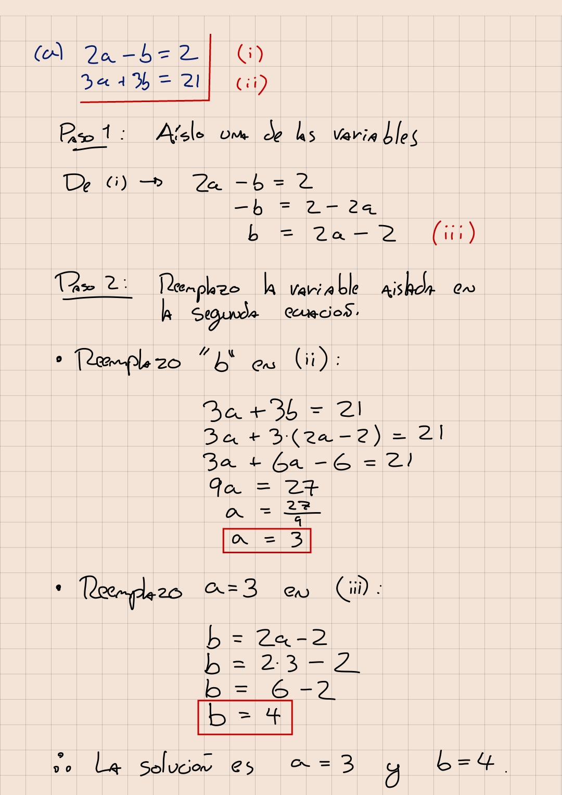
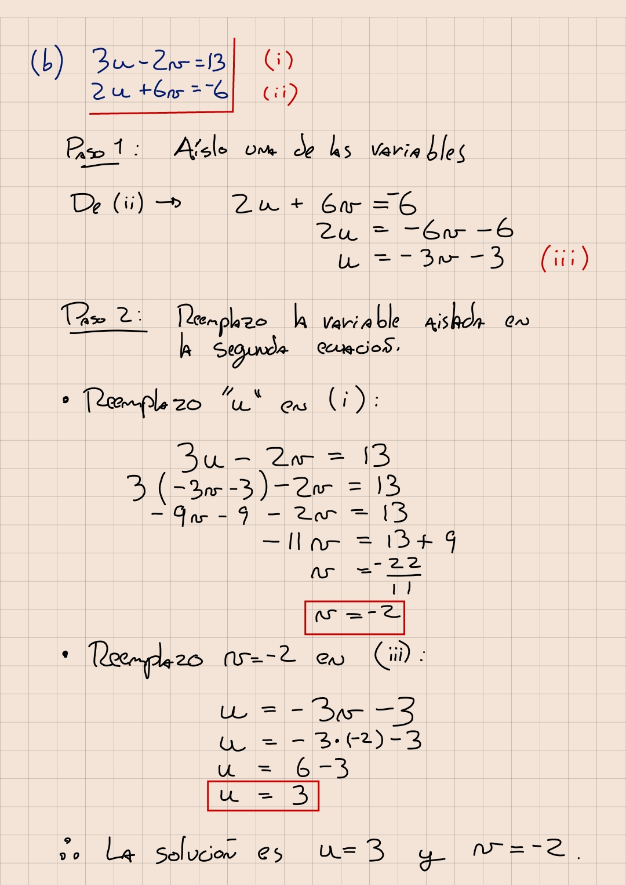
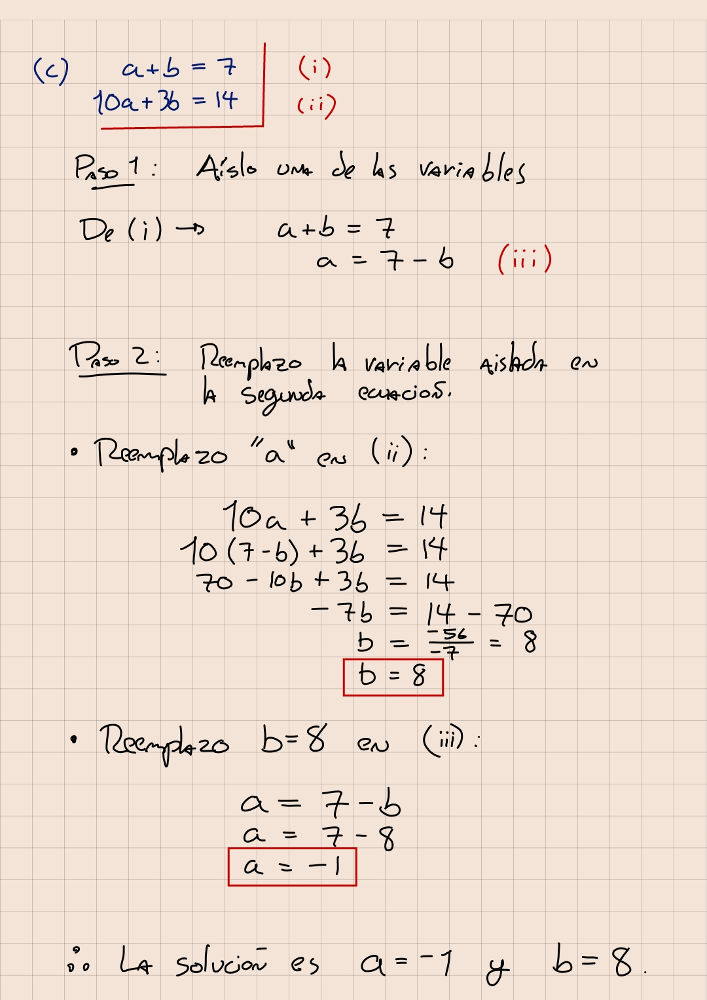
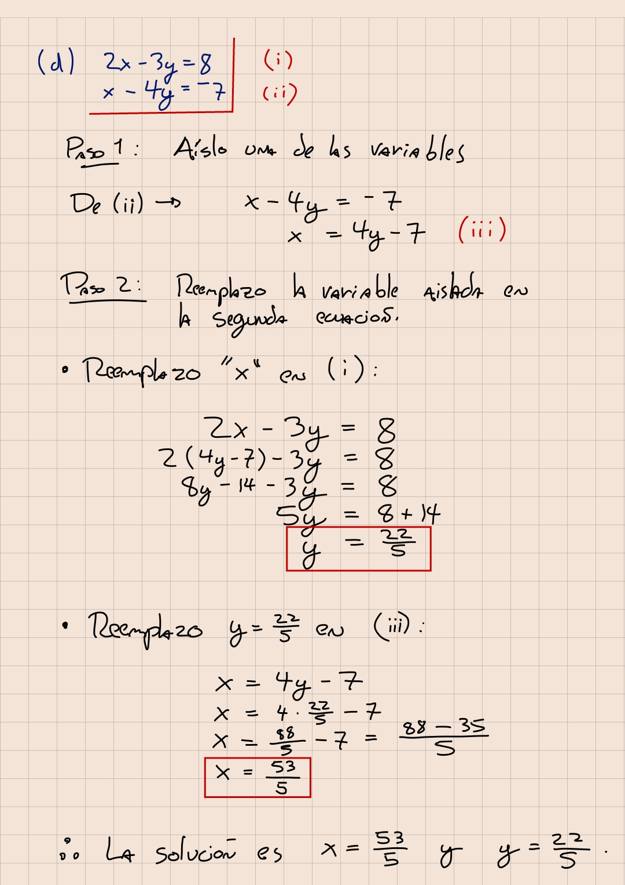
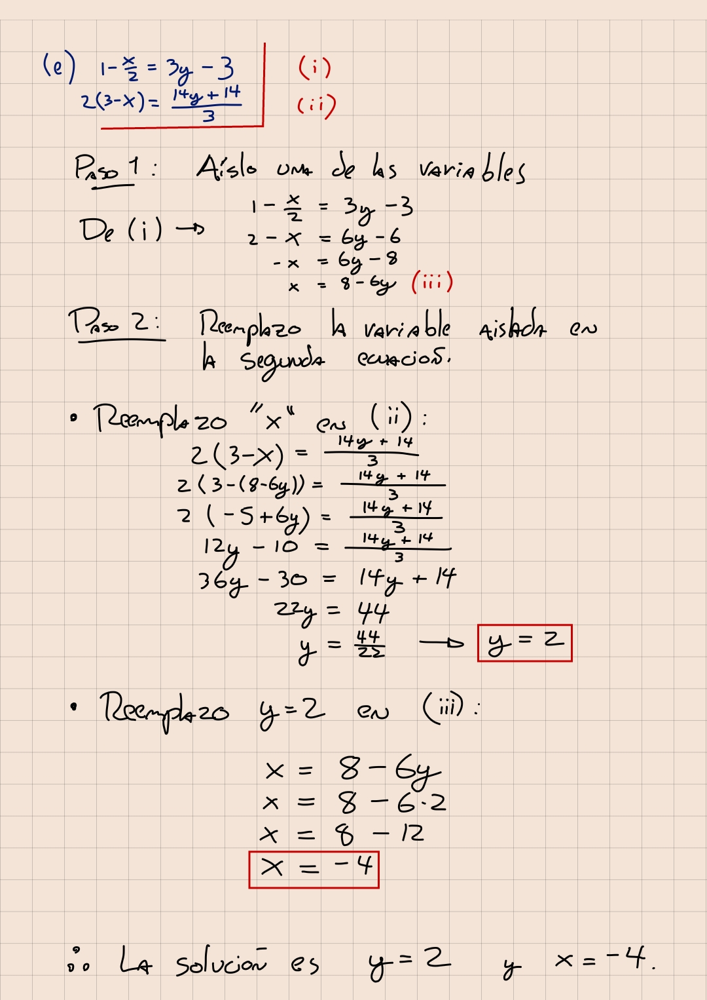
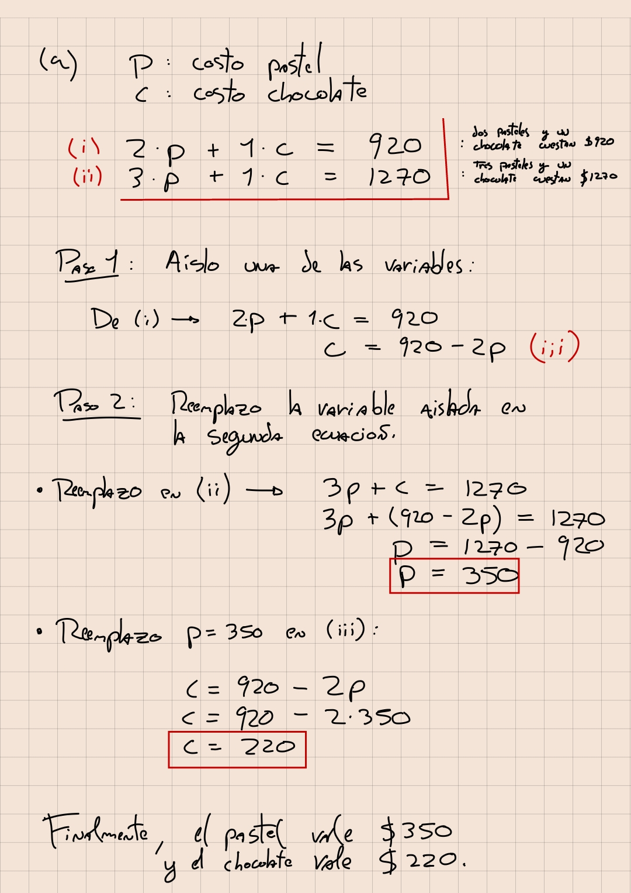
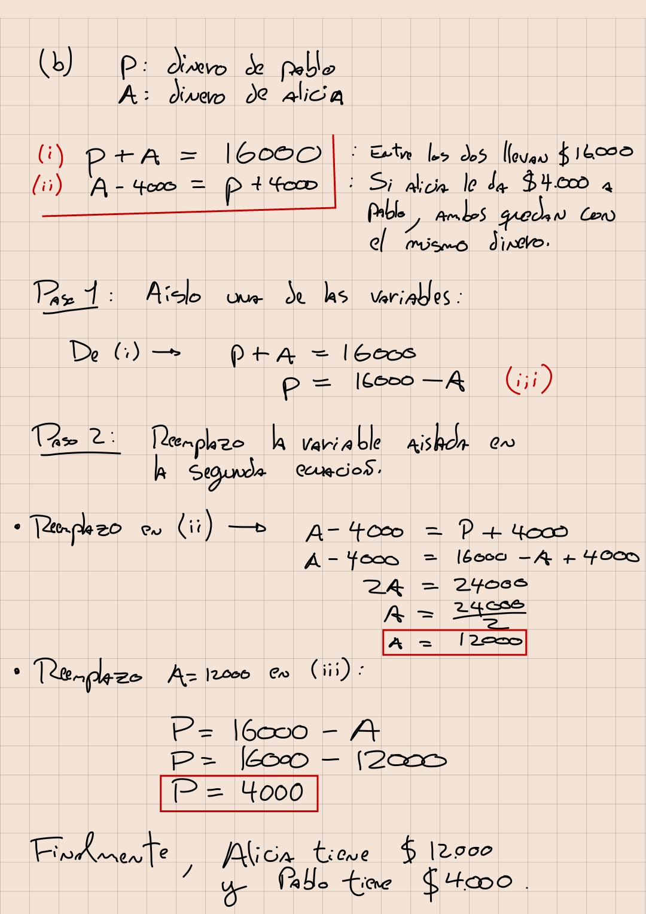
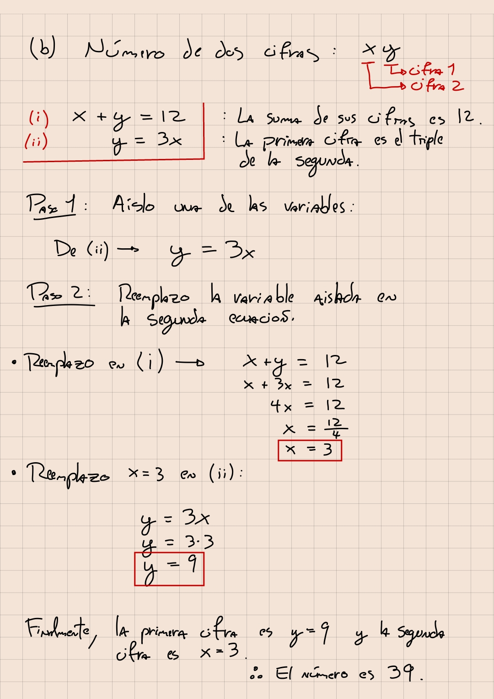
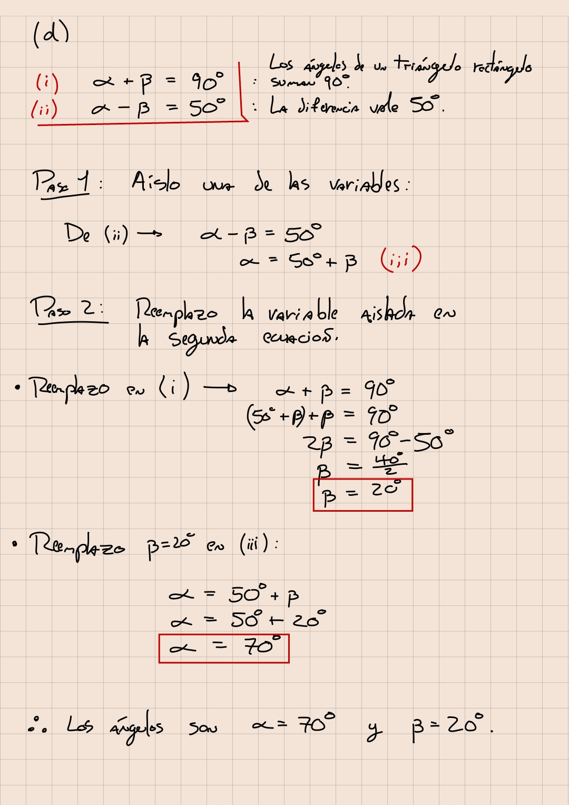
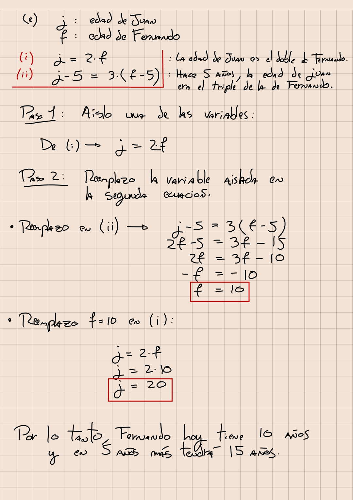

# ayudantia-05

martes 18 abril 2023

Se resolvieron los ejercicios 03 y 05 de la ayudantía 04 que quedaron pendientes.

## ejercicio-01: sistemas de ecuaciones

resuelva los siguientes sistemas de ecuaciones:

a) 

$$\begin{align}
2a - b &= 2 \\
3a + 3b &= 21
\end{align}$$

b) 

$$
\begin{align}
3u - 2v &= 13\\
2u + 6v &= -6
\end{align}
$$

c) 

$$
\begin{align}
a + b &= 7\\
10a + 3b &= 14
\end{align}
$$

d) 

$$
\begin{align}
2x - 3y &= 8\\
x - 4y &= -7
\end{align}
$$

e)

$$
\begin{align}
1 - \frac{x}{2} &= 3y - 3\\
2(3-x) &= \frac{14y+14}{3}
\end{align}
$$

--- solución ---

a) $a=3$, $b=4$ 

b) $u=3$, $v=-2$

c) $a=-1$, $b=8$

d) $x=53/5$, $y=22/5$

e) $x=-4$, $y=2$

## ejercicio-02: aplicación de sistemas de ecuaciones

a) Dos pasteles y un chocolate cuestan $920. Tres pasteles y un chocolate cuestan $1270. ¿Cuánto cuesta el pastel? ¿Y un chocolate?

b) Pablo y Alicia llevan entre los dos $16000. Si Alicia le da a Pablo $4000, ambos tendrán la misma cantidad ¿Cuánto dinero lleva cada uno?

c) Hallar un número de dos cifras sabiendo que la suma de las cifras es 12 y que la primera de ellas es el triple de la segunda.

d) La diferencia entre los dos ángulos de un triángulo rectángulo es de 50°. ¿Cuánto valen cada ángulo?

e) La edad de Juan es el doble que la de Fernando. Hace 5 años, Juan tenía el triple de edad que Fernando. ¿Cuál será la edad de Fernando dentro de 5 años?

--- solución ---

a) El pastel cuesta $350 y el chocolate $220

b) Pablo tiene $4000 y Alicia tiene $12000.

c) El número que cumple estas condiciones es el número 39.

d) Un ángulo vale 20° y el otro 70°

e) Fernando tiene 10 años y en 5 años más tendrá 15 años.

