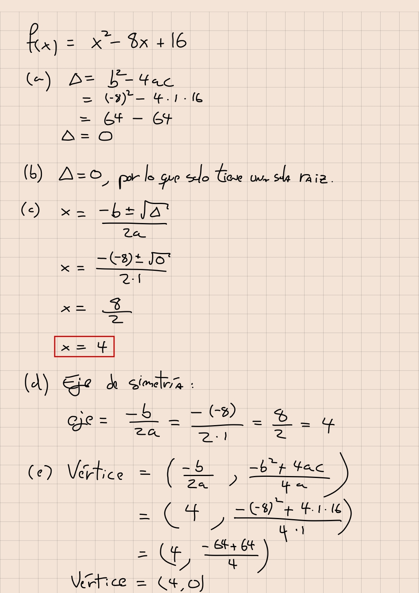

# ayudantia-06

martes 25 abril 2023

## ejercicio-01: sistemas de inecuaciones

resuelva gráficamente los siguientes sistemas de inecuaciones.

a) 

$$\begin{align}
2x + y &\leq 3 \\
x + y &\geq 1
\end{align}$$

b) 

$$\begin{align}
x + y &> 2 \\
y &\geq 2x + 5
\end{align}$$

--- solución ---

## ejercicio-02: funciones cuadráticas

para las siguientes funciones cuadráticas

$$f_1(x) = -x^2 + 2x + 3$$

$$f_2(x) = x^2 - 8x + 16$$

determinar:

a) el discriminante de la función

b) el número de raíces

c) las raíces de la función.

d) eje de simetría

e) coordenadas de su vértice

f) esbozar su gráfico

--- solución ---

## ejercicio-03: funciones cuadráticas ii

si la función $f(x) = x^2 + ax + a$, pasa por el punto $(1,9)$.

¿cuánto vale $a$?

--- solución ---

$a=4$

## ejercicio-04: funciones cuadráticas iii

si una función cuadrática $f(x) = ax^2 + bx + c$ pasa por el punto $(0,2)$ y tiene su vértice en las coordenadas $(1,1)$. ¿cuánto valen $a$, $b$ y $c$?

--- solución ---

$a=1$, $b=-2$, $c=2$

$f(x) = x^2 - 2x + 2$

