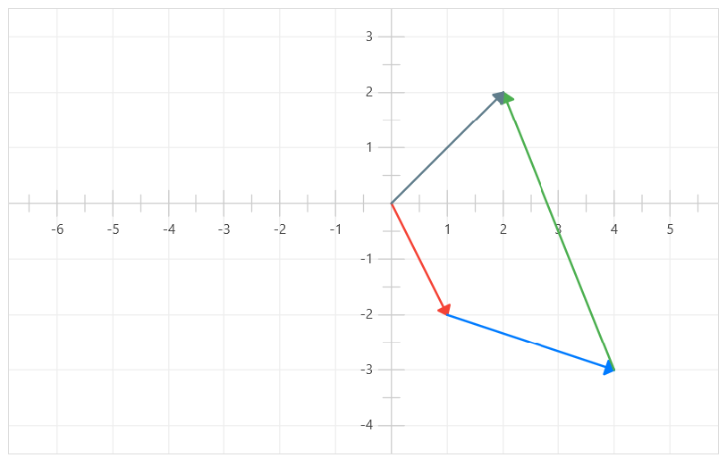
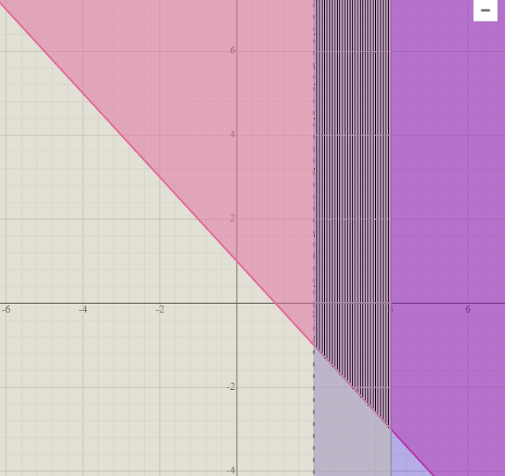

# control-02 pauta

viernes 28 abril 2023, presencial

instrucciones:

* control individual
* entregar soluciones en hojas con nombre, fecha, número de ejercicio
* responder máximo 3 de los 4 ejercicios
* evaluaremos los 2 mejores ejercicios que contesten, el tercero no cuenta

pauta:
* cada control tiene 1 punto base, más 3 puntos por cada ejercicio considerado
* cada ejercicio tiene parte a. y b., cada una de 1.5 puntos máximo donde:
    * 1.5 puntos si el proceso está completo, y el resultado es correcto
    * 1.0 puntos si el proceso está completo, pero el resultado tiene errores menores
    * 0.5 puntos si el proceso empezó bien, pero luego hubo errores graves y resultado incorrecto
    * 0.0 puntos si está en blanco o el resultado y el proceso tienen errores gravísimos

## ejercicio-01: vectores (3 puntos)

teniendo los vectores:

$$\vec{a} = 2 \cdot (1/2,-1)$$

$$\vec{b} = (-3,1)$$

$$\vec{d} = \vec{a} - \vec{b} + \vec{c} = (2,2)$$

a) ¿cuánto vale $\vec{c}$?

b) dibuje los vectores $\vec{a}$, $\vec{b}$ y $\vec{c}$ en el plano cartesiano.

c) exprese en un gráfico la operación vectorial $\vec{d} = \vec{a} - \vec{b} + \vec{c}$.

---
***--- solución ---***

a) $\vec{c} = (-3,5)$

b) 

---

## ejercicio-02: sistemas de ecuaciones (3 puntos)

a) resuelva el siguiente sistema de ecuaciones:

$$\begin{align*}
5x + 2y &= 6 \\
x + \frac{1}{2}y &= 3
\end{align*}$$

b) cuatro pasteles y tres chocolates cuestan $1800. un pastel y dos chocolates cuestan $700. ¿cuánto me cuesta llevar 10 pasteles más 10 chocolates?

---
***--- solución ---***

a) $x=-6, y=18$

b) El chocolate cuesta $200, el pastel cuesta $300. Llevar 10 de cada uno cuesta $5000.

---

## ejercicio-03: sistemas de inecuaciones (3 puntos)

a) resuelva gráficamente el siguiente sistemas de inecuaciones:

$$\begin{align*}
x + y &\geq 1 \\
x &> 2 \\
x &\leq 4 \\
\end{align*}$$

---
***--- solución ---***

el conjunto solución está en el área achurada:

---

b) con este sistema de inecuaciones, defina soluciones aproximadas de y, asumiendo x muy grande.

$$\begin{align*}
-3x + y &\geq 7 \\
4x + 2y &\leq -1 \\
\end{align*}$$

---
***--- solución ---***

si $x=1M$ un número muy grande: 

$$\begin{align*}
-3M + y &\geq 7\\
y &\geq 3M + 7\\
\text{como M es muy grande: } \\
y &\geq 3M \\
\end{align*}$$

en la otra ecuación hacemos lo mismo

$$\begin{align*}
4M + 2y &\leq -1 \\
2y &\leq -1 - 4M \\
2y &\leq -\frac{1}{2} - 2M \\
\text{como M es muy grande: } \\
y &\leq -2M \\
\end{align*}$$

entonces para un X muy grande,
tenemos que Y debe ser mayor o igual a 3M y también
menor o igual a -2M. 

los conjuntos no coinciden por lo que el sistema de ecuaciones no tiene solución.

---

## ejercicio-04: funciones cuadráticas (3 puntos)

si la función cuadrática 

$$f(x) = ax^2+bx+c$$ 

pasa por los puntos $(1,1)$, $(0,0)$ y $(-1,1)$.

a) ¿cuánto valen $a$, $b$ y $c$?

b) ¿la parábola se extiende hacia arriba o hacia abajo?

---
***--- solución ---***

a) $a=1, b=0, c=0$

d) $a>0$, por lo que la parabola se extiende hacia arriba.

---