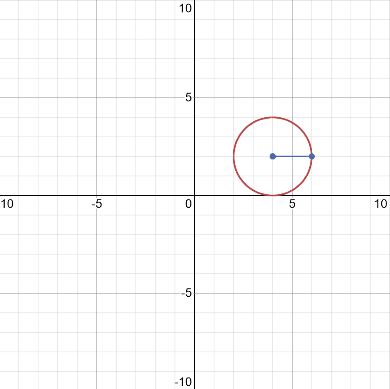
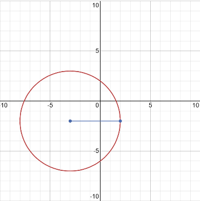
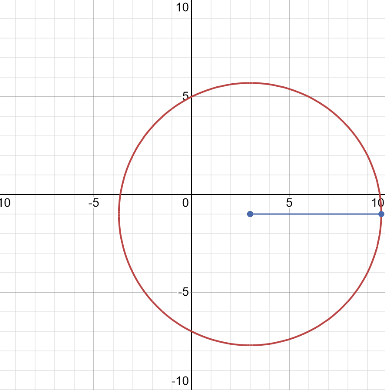

# ayudantia-10

martes 5 junio 2023

## ejercicio-01

a) determine la ecuación de la circunferencia que tiene su centro en el punto $(4,2)$ y tiene diámetro $4$.

b) grafique la circunferencia.

--- solución ---

a) para encontrar la ecuación de la circunferencia necesitamos el radio y las coordenadas del centro:

del enunciado: 

- el diámetro es 4, por lo tanto el radio es igual a 2.
- el centro es el punto $(4,2)$.

teniendo estos dos elementos podemos reemplazar en la ecuación canónica de la circunferencia para obtener la ecuación.

$$(x-x_0)^2 + (y-y_0)^2 = r^2$$

en este caso $x_0=4$, $y_0=2$, $r=2$. 

reemplazando obtenemos la ecuación: 

$$(x-4)^2 + (y-2)^2 = 2^2$$

$$(x-4)^2 + (y-2)^2 = 4$$

b) para graficar ubicamos las coordenadas del punto central en el plano cartesiano, proyectamos el radio y dibujamos una circunferencia.

## ejercicio-02

a) determine la ecuación de la circunferencia que tiene su centro en el punto $(-3,-2)$ y tiene radio $5$.

b) ¿cuál es la distancia entre el centro de la circunferencia y el centro del mapa cartesiano?

c) ¿en qué puntos la circunferencia cruza al eje y?

d) grafique la circunferencia.

--- solución ---

a) en este caso $x_0=-3$, $y_0=-2$, $r=5$. 

reemplazando en la ecuación canónica obtenemos la ecuación: 

$$(x-x_0)^2 + (y-y_0)^2 = r^2$$

$$(x-(-3))^2 + (y-(-2))^2 = 5^2$$

$$(x+3)^2 + (y+2)^2 = 25$$

b) para calcular la distancia entre el punto central $(-3,2)$ y el origen $(0,0)$ utilizamos la fórmula para calcular la distancia entre dos puntos que deriva del teorema de pitágoras:

$$d=\sqrt{(x_2-x_1)^2+(y_2-y_1)^2}$$

reemplazando obtenemos

$$d=\sqrt{(-3-0)^2+(-2-0)^2}$$

$$d=\sqrt{9+4}$$

$$d=\sqrt{13}$$

$$d\approx3.6$$

c) para calcular los puntos en que cruza al eje $y$, reemplazamos $x=0$ en la ecuación de la circunferencia.

$$(x+3)^2 + (y+2)^2 = 25$$

$$(0+3)^2 + (y+2)^2 = 25$$

$$9 + (y+2)^2 = 25$$

$$9 + y^2 + 4y + 4 = 25$$

$$9 + y^2 + 4y + 4 - 25 = 0$$

$$y^2 + 4y -12 = 0$$

esta es una ecuación cuadrática de la forma $ay^2+by+c = 0$ que se resuelve con la fórmula:

$$y = \frac{-b \pm \sqrt{b^2-4ac}}{2a}$$

en este caso, $a=1$, $b=4$ y $c=-12$

reemplazando obtenemos:

$$y = \frac{-b \pm \sqrt{b^2-4ac}}{2a}$$

$$y = \frac{-4 \pm \sqrt{4^2-4\cdot 1 \cdot 12}}{2}$$

$$y = \frac{-4 \pm \sqrt{64}}{2}$$

$$y = \frac{-4 \pm 8}{2}$$

$$y = -2 \pm 4$$

de acá se obtienen dos soluciones:

$$y_1 = 2$$

$$y_2 = -6$$

finalmente podemos concluir que la circunferencia cruza al eje $y$ en las coordenadas $(0,2)$ y $(0,-6)$.

d) gráfico:

## ejercicio-03

calcular la ecuación de la circunferencia concéntrica con la circunferencia descrita por la ecuación $(x-3)^2+(y+1)^2=16$ y que pasa por el punto $p_1=(-3,4)$.

--- solución ---

para encontrar la circunferencia necesitamos su radio $r$ y las coordenadas del centro.

la circunferencia que buscamos comparte centro con la ecuación dada $(x-3)^2+(y+1)^2=16$, por lo tanto su centro está en las coordenadas $(3,-1)$-

el radio lo podemos encontrar calculando la distancia entre el centro $(3,1)$ y el punto $p_1=(-3,4)$. 

utilizamos la fórmula para calcular la distancia entre dos puntos:

$$r=\sqrt{(x_2-x_1)^2+(y_2-y_1)^2}$$

reemplazando obtenemos

$$r=\sqrt{(3-(-3))^2+(1-4)^2}$$

$$r=\sqrt{36+9}$$

$$r=\sqrt{45}$$

finalmente teniendo el centro y el radio, reemplazamos en la ecuación canónica de la circunferencia y obtenemos: 

$$(x-x_0)^2 + (y-y_0)^2 = r^2$$

$$(x-3)^2 + (y+1)^2 = 45$$

## ejercicio-04 

los extremos del diámetro de una circunferencia son los puntos $p_1=(-5,3)$ y $p_2=(3,1)$.

determine la ecuación de esta circunferencia.

--- solución ---

para encontrar la ecuación de la circunferencia necesitamos el centro y el radio.

el centro lo podemos obtener calculando la coordenada central entre los puntos $p_1=(-5,3)$ y $p_2=(3,1)$.

$$centro = (\frac{-5+3}{2}, \frac{3+1}{2})$$

$$centro = (\frac{-2}{2}, \frac{4}{2})$$

$$centro = (-1, 2)$$

el radio lo podemos obtener calculando la distancia entre los puntos $p_1=(-5,3)$ y $p_2=(3,1)$ y dividiendo el resultado a la mitad.

$$r= \frac{\sqrt{(x_2-x_1)^2+(y_2-y_1)^2}}{2}$$

$$r= \frac{\sqrt{(3-(-5))^2+(1-3)^2}}{2}$$

$$r= \frac{\sqrt{8^2+(-2)^2}}{2}$$

$$r= \frac{\sqrt{68}}{2}$$

$$r= \frac{2\sqrt{17}}{2}$$

$$\therefore r= \sqrt{17}$$

finalmente la ecuación: 

$$(x-x_0)^2 + (y-y_0)^2 = r^2$$

en este caso $x_0=-1$, $y_0=2$, $r=\sqrt{17}$.

reemplazando obtenemos la ecuación: 

$$(x+1)^2 + (y-2)^2 = 17$$

## ejercicio-05

calcular la ecuación de la circunferencia de radio 5 y que tiene su centro en el punto de intersección de las rectas 

$$x+3y+3=0$$

$$x+y+1=0$$

--- solución ---

para encontrar el centro de la circunferencia debemos encontrar el punto de intersección de las rectas dadas, para eso resolvemos el sistema de ecuaciones de dos incógnitas: 

$$
\begin{*align}
(i) &\ \ \ \ x+3y+3=0\\
(ii) &\ \ \ \ x+y+1=0
\end{*align}
$$

**paso 1:** de $(ii)$ aislamos $x$.

$$(ii) \ \ \ \ x=-y-1$$

**paso 2:** reemplazamos en $(i)$ para obtener una ecuación para $y$.

$$
\begin{*align}
(i) &\ \ \ \ x+3y+3=0\\
&\ \ \ \ (-y-1)+3y+3=0\\
&\ \ \ \ 2y+2=0\\
&\ \ \ \ y=\frac{-2}{2}\\
&\ \ \ \ y=-1\\
\end{*align}
$$

**paso 3:** reemplazo $y=-1$ en $(ii)$.

$$
\begin{*align}
(ii) &\ \ \ \ x=-y-1\\
&\ \ \ \ x=-(-1)-1\\
&\ \ \ \ x=0
\end{*align}
$$

por lo tanto el centro de la circunferencia está en $(0,-1)$ y tiene radio $5$.

reemplazando en la ecuación canónica de la circunferencia:

$$(x-x_0)^2 + (y-y_0)^2 = r^2$$

en este caso $x_0=0$, $y_0=-1$, $r=5$.

reemplazando obtenemos la ecuación: 

$$(x-0)^2 + (y-(-1))^2 = 5^2$$

$$(x-0)^2 + (y+1)^2 = 25$$

