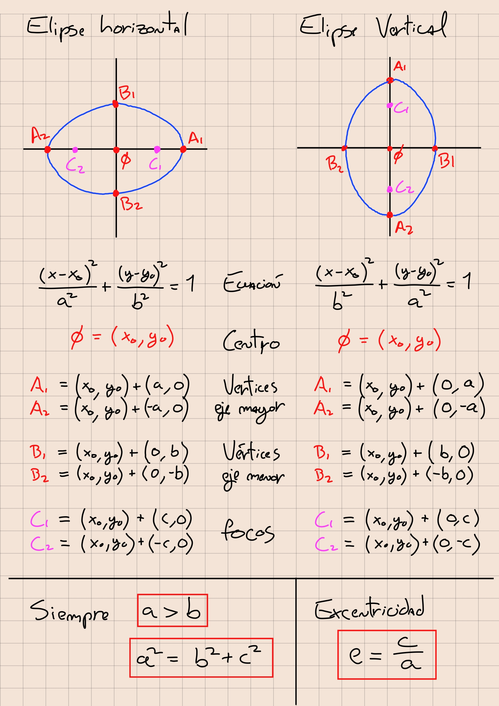

# ayudantia-11

martes 13 junio 2023

## ejercicio-01

a) calcule la ecuación de la elipse horizontal con centro en el origen. semieje mayor 4, semieje menor 2. 

b) calcule las coordenadas de sus focos, la distancia focal y su excentricidad

c) graficar marcando las coordenadas de sus vértices y sus focos.

--- solución ---

---

a) la ecuación canónica para una elipse horizontal es 

$$\frac{(x-x_0)^2}{a^2} + \frac{(y-y_0)^2}{b^2} = 1$$

donde el semieje mayor es $a=4$ y semieje menor $b=2$. Su centro está en el origen por lo que $(x_0, y_0) = (0,0)$. Reemplazando estos valores la ecuación queda:

$$\frac{(x-0)^2}{4^2} + \frac{(y-0)^2}{2^2} = 1$$

$$\frac{x^2}{16} + \frac{y^2}{4} = 1$$

---

b) el foco $c$ cumple la relación 

$$a^2=b^2+c^2$$

tenemos los semiejes $a$ y $b$, despejando para $c$ se obtiene

$$c = \sqrt{a^2-b^2}$$

$$c = \sqrt{4^2-2^2}$$

$$c = \sqrt{16-4}$$

$$c = \sqrt{12} = 2\sqrt{3}$$

$$c \approx 3.46$$

finalmente tenemos que la coordenada de los focos son $C_1=(c,0)$ y $C_2=(-c,0)$

$$C_1=(2\sqrt{3},0)\approx (3.46,0)$$

$$C_2=(-2\sqrt{3},0)\approx (-3.46,0)$$

la distancia focal corresponde a la distancia entre ambos focos por lo que se calcula como $2c$, y vale $2\sqrt{12} \approx 6.928$.

la excentricidad se calcula como

$$e = \frac{c}{a}$$

$$e = \frac{\sqrt{12}}{4}$$

$$e \approx 0.866$$

la excentricidad es cercana a 1, lo que indica que es más alargada que redonda.

---

c) gráfico:

la elipse tiene sus vértices en

$$A_1 = (a,0) = (4,0)$$

$$A_2 = (-a,0) = (-4,0)$$

$$B_1 = (0,b) = (0,2)$$

$$B_2 = (0,-b) = (0,-2)$$

---

## ejercicio-02

hallar la ecuación de la elipse conociendo:

a) $\phi(0,0)$, $C_1(2,0)$, $A_1(3,0)$

b) $\phi(0,0)$, $C_1(0,4)$, $A_1(0,5)$

c) $\phi(1,-1)$, $C_1(1,2)$, $A_1(1,4)$

d) $\phi(-3,2)$, $C_1(-1,2)$, $A_1(2,2)$

donde $\phi$ corresponde a la coordenada del centro, $C_1$ corresponde a la coordenada de uno de los focos, y $A_1$ a la coordenada de uno de los vértices del semieje mayor.

--- solución ---

---

a) $\phi(0,0)$, $C_1(2,0)$, $A_1(3,0)$

como el centro está en el origen, de los datos se tiene que:

- es una elipse horizontal.
- $a=3$
- $c=2$

podemos hallar $b$ haciendo 

$$b=\sqrt{a^2-c^2}$$

$$b=\sqrt{3^2-2^2}$$

$$b=\sqrt{5}$$

como es una elipse horizontal, la ecuación buscada es: 

$$\frac{(x-x_0)^2}{a^2} + \frac{(y-y_0)^2}{b^2} = 1$$

$$\frac{(x-0)^2}{3^2} + \frac{(y-0)^2}{\sqrt{5}^2} = 1$$

$$\frac{x^2}{9} + \frac{y^2}{5} = 1$$

---

b) $\phi(0,0)$, $C_1(0,4)$, $A_1(0,5)$

como el centro está en el origen, de los datos se tiene que:

- es una elipse vertical.
- $a=5$
- $c=4$

podemos hallar $b$ haciendo 

$$b=\sqrt{a^2-c^2}$$

$$b=\sqrt{5^2-4^2}$$

$$b=\sqrt{9}$$

$$b=3$$

como es una elipse vertical, la ecuación buscada es: 

$$\frac{(x-x_0)^2}{b^2} + \frac{(y-y_0)^2}{a^2} = 1$$

$$\frac{(x-0)^2}{3^2} + \frac{(y-0)^2}{5^2} = 1$$

$$\frac{x^2}{9} + \frac{y^2}{25} = 1$$

---

c) $\phi(1,-1)$, $C_1(1,2)$, $A_1(1,4)$

esta vez la elipse no está en el origen, por lo que para obtener $a$ y $c$ debemos restar las coordenadas del origen.

- es una elipse vertical.
- $a=4-(-1)=5$
- $c=2-(-1)=3$

podemos hallar $b$ haciendo 

$$b=\sqrt{a^2-c^2}$$

$$b=\sqrt{5^2-3^2}$$

$$b=\sqrt{16}$$

$$b=4$$

como es una elipse vertical, la ecuación buscada es: 

$$\frac{(x-x_0)^2}{b^2} + \frac{(y-y_0)^2}{a^2} = 1$$

$$\frac{(x-1)^2}{4^2} + \frac{(y-(-1))^2}{5^2} = 1$$

$$\frac{(x-1)^2}{16} + \frac{(y+1)^2}{25} = 1$$

---

d) $\phi(-3,2)$, $C_1(-1,2)$, $A_1(2,2)$

- es una elipse horizontal.
- $a=2-(-3)=5$
- $c=-1-(-3)=2$

podemos hallar $b$ haciendo 

$$b=\sqrt{a^2-c^2}$$

$$b=\sqrt{5^2-2^2}$$

$$b=\sqrt{21}$$

como es una elipse horizontal, la ecuación buscada es: 

$$\frac{(x-x_0)^2}{a^2} + \frac{(y-y_0)^2}{b^2} = 1$$

$$\frac{(x-(-3))^2}{5^2} + \frac{(y-2)^2}{\sqrt{21}^2} = 1$$

$$\frac{(x+3)^2}{25} + \frac{(y-2)^2}{21} = 1$$

---

## ejercicio-03

dada la elipse de ecuación

$$\frac{(x-6)^2}{36} + \frac{(y+4)^2}{16} = 1$$

a) hallar su centro, semiejes, vértices y focos

b) graficar

--- solución ---

---

a) para averiguar los parámetros pedidos se debe adaptar la ecuación a la forma canónica.

$$\frac{(x-x_0)^2}{a^2} + \frac{(y-y_0)^2}{b^2} = 1$$

$$\frac{(x-6)^2}{36} + \frac{(y+4)^2}{16} = 1$$

$$\frac{(x-6)^2}{6^2} + \frac{(y-(-4))^2}{4^2} = 1$$

de esta expresión se puede concluir:

- el centro $\phi = (6,-4)$

- semieje mayor $a=6$

- semieje menor $b=4$

- como el semieje mayor está con $x^2$, corresponde a una elipse horizontal.

- sus vértices están en las coordenadas: 

$$A_1 = \phi + (a,0) = (6,-4) + (6,0) = (12,-4)$$

$$A_2 = \phi + (-a,0) = (6,-4) + (-6,0) = (0,-4)$$

$$B_1 = \phi + (0,b) = (6,-4) + (0,4) = (6,0)$$

$$B_2 = \phi + (0,-b) = (6,-4) + (0,-4) = (6,-8)$$

- para encontrar los focos se debe calcular $c = \sqrt{a^2-b^2} = \sqrt{6^2-4^2} = \sqrt{20} \approx 4.472$

$$C_1 = \phi + (c,0) = (6,-4) + (\sqrt{20},0) = (6+\sqrt{20},-4)$$

$$C_2 = \phi + (-c,0) = (6,-4) + (-\sqrt{20},0) = (6-\sqrt{20},-4)$$

---

b) gráfico:

---

## ejercicio-04

hallar la ecuación de la elipse con centro en el origen que pasa por el punto (0,4) y tiene excentricidad $\frac{3}{5}$

--- solución ---

---

tomando la ecuación canónica

$$\frac{(x-x_0)^2}{a^2} + \frac{(y-y_0)^2}{b^2} = 1$$

reemplazamos el centro $(0,0)$ y el punto $x=0$ e $y=4$ y resolvemos:

$$\frac{(0-0)^2}{a^2} + \frac{(4-0)^2}{b^2} = 1$$

$$\frac{0}{a^2} + \frac{4^2}{b^2} = 1$$

$$\frac{4^2}{b^2} = 1$$

$$b^2 = 4^2$$

$$\therefore \ b=4$$

ahora tomando la excentricidad:

$$e = \frac{c}{a} = \frac{3}{5}$$

no conocemos c, pero sabemos que $c = \sqrt{a^2-b^2}$

$$e = \frac{ \sqrt{a^2-b^2}}{a} = \frac{3}{5}$$

de lo anterior sabemos que $b=4$, reemplazamos y resolvemos para $a$:

$$\frac{ \sqrt{a^2-4^2}}{a} = \frac{3}{5}$$

$$a^2-4^2 = \frac{3^2}{5^2}a^2$$

$$a^2-4^2 = \frac{9}{25}a^2$$

$$25a^2-400 = 9a^2$$

$$16a^2=400$$

$$a=\sqrt{\frac{400}{16}}$$

$$a=\sqrt{25}$$

$$\therefore \ a=5$$

teniendo los valores de $a$ y $b$ podemos escribir la ecuación buscada:

$$\frac{(x-x_0)^2}{a^2} + \frac{(y-y_0)^2}{b^2} = 1$$

$$\frac{x^2}{5^2} + \frac{y^2}{4^2} = 1$$

$$\frac{x^2}{25} + \frac{y^2}{16} = 1$$

---

