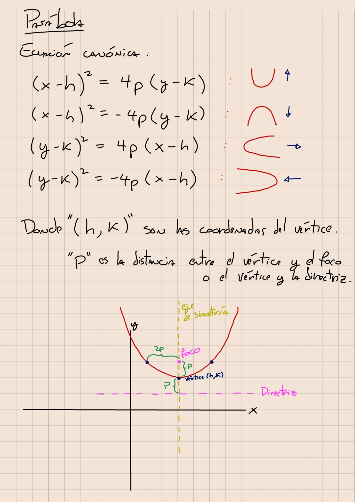
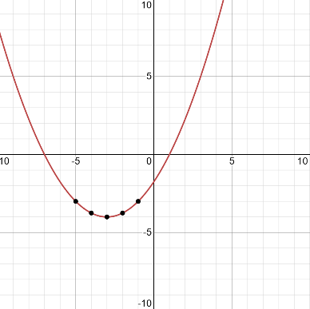
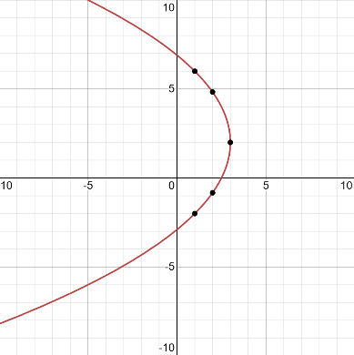

# ayudantia-12

martes 27 junio 2023

## ejercicio-01

calcule el vértice, el foco, el eje de simetría y la directriz de la parábola $(x+3)^2=4(y+4)$.

grafique.

--- solución ---

---
la ecuación es de la forma $(x-h)^2=4p(y-k)$, por lo que representa una parábola que se extiende hacia arriba.

de la ecuación $(x+3)^2=4(y+4)$ se extrae que su vértice está en las coordenadas $(h,k)=(-3,4)$ y su parámetro $p$ es igual a $1$.

su foco está $p=1$ unidades hacia arriba del vértice, por lo que se ubica en las coordenadas $(-2,4)$.

su eje de simetría es la recta que pasa por el vértice y divide la parábola en dos. Como la parábola se extiende hacia arriba, su eje de simetría es la recta $x=-3$.

su directriz es una recta que pasa $p=1$ unidades abajo del vértice y es perpendicular al eje de simetría. En este caso es la recta $y=-5$.

el gráfico es el siguiente:

---

## ejercicio-02

dada la parábola $(y-2)^2=-8(x-3)$.

calcule su vértice, el foco, su directriz y eje de simetría.

grafique.

--- solución ---

---
la ecuación es de la forma $(y-k)^2=-4p(x-h)$, por lo que representa una parábola que se extiende hacia la izquierda.

de la ecuación $(y-2)^2=-8(x-3)$ se extrae que su vértice está en las coordenadas $(h,k)=(3,2)$ y su parámetro $p$ es igual a $2$.

su foco está $p=2$ unidades hacia la izquierda del vértice, por lo que se ubica en las coordenadas $(1,2)$.

su eje de simetría es la recta que pasa por el vértice y divide la parábola en dos. Como la parábola se extiende hacia la izquierda, su eje de simetría es la recta $y=2$.

su directriz es una recta que pasa $p=2$ unidades a la derecha del vértice y es perpendicular al eje de simetría. En este caso es la recta $x=5$.

el gráfico es el siguiente:

---

## ejercicio-03

si el vértice de una parábola está ubicado en el punto $(-2,4)$ y su directriz es $y=7$ ¿cuál es su ecuación?

--- solución ---

---
nos dan el vértice y la directriz.

notamos que la directriz está arriba del vértice, por lo que la parábola buscada se extiende hacia abajo y su ecuación es de la forma $(x-h)^2=-4p(y-k)$.

podemos calcular el parámetro $p$ encontrando la distancia entre el vértice y la directriz, en este caso $p=7-4=3$.

sabiendo todo esto podemos escribir la ecuación de la parábola.

$$(x-h)^2=-4p(y-k)$$

$$(x-(-2))^2=-4 \cdot 3 \cdot (y-4)$$

$$(x+2)^2=-12(y-4)$$

---

## ejercicio-04

hallar la ecuación de la parábola cuyo vértice está en el origen, pasa por el punto $(3,4)$ y su eje de simetría es el eje x.

--- solución ---

---
su vértice está en el origen $(0,0)$ y su eje de simetría es el eje x, por lo que es una parábola que se extiende hacia la derecha o la izquierda.

pasa por el punto $(3,4)$, por lo que se extiende hacia la derecha y su ecuación es de la forma $(y-k)^2=4p(x-h)$.

ya tenemos el vértice y solo falta encontrar el parámetro $p$.

para encontrar el parámetro $p$ reemplazamos el punto dado $(3,4)$ en la ecuación de la parábola.

$$(y-k)^2=4p(x-h)$$

$$(y-0)^2=4p(x-0)$$

$$(4-0)^2=4p(3-0)$$

$$4^2=4 \cdot 3 \cdot p$$

$$p = \frac{4}{3}$$

finalmente la ecuación es:

$$(y-k)^2=4p(x-h)$$

$$(y-0)^2=4 \cdot \frac{4}{3} \cdot(x-0)$$

$$y^2=\frac{16}{3} x$$
---

## ejercicio-05

determina la ecuación de la parábola que tiene por directriz la recta $y=1$ y por foco el punto $(2,5)$.

--- solución ---

---
el foco está arriba de la directriz, por lo que esta es una parábola que se extiende hacia arriba.

la distancia entre la directriz y el foco es igual a $2p$, por lo que:

$$2p=5-1$$

$$2p=4$$

$$p=2$$

para encontrar el vértice debemos bajar $p$ desde el foco, por lo que el vértice está ubicado en $(2,3)$.

finalmente la ecuación de la parábola es:

$$(x-h)^2=4p(y-k)$$

$$(x-2)^2=4\cdot 2 \cdot(y-3)$$

$$(x-2)^2=8(y-3)$$

---

