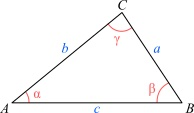

# control-01

martes 04 abril 2023, presencial

instrucciones:

- control individual
- entregar soluciones en hojas con nombre, fecha, número de ejercicio
- responder máximo 3 de los 4 ejercicios
- evaluaremos los 2 mejores ejercicios que contesten, el tercero no cuenta

pauta:

- cada control tiene 1 punto base, más 3 puntos por cada ejercicio considerado
- cada ejercicio tiene parte a. y b., cada una de 1.5 puntos máximo donde:
  - 1.5 puntos si el proceso está completo, y el resultado es correcto
  - 1.0 puntos si el proceso está completo, pero el resultado tiene errores menores
  - 0.5 puntos si el proceso empezó bien, pero luego hubo errores graves y resultado incorrecto
  - 0.0 puntos si está en blanco o el resultado y el proceso tienen errores gravísimos

## ejercicio-01: números con base 10 y base 2 (3 puntos)

a. convierta el número binario $110110101_{(base2)}$ a su forma decimal (base 10).

b. convierta el número decimal $131_{(base10)}$ a su forma binaria (base 2).

## ejercicio-02 (3 puntos)

considerando el triángulo de la figura anterior, calcule:

a. si $b=12$, $c=8$ y $\alpha = 63°$ - ¿cuál es la longitud del lado $a$?

b. si $\alpha = 25°$, $\beta = 72°$ y $c = 12$ - ¿cuánto mide $\gamma$? expresar resultado en grados y en **radianes** - ¿cuál es la longitud de $b$?

## ejercicio-03 (3 puntos)

necesito diseñar una rampa para uso con silla de ruedas. la entrada de mi casa es un escalon con una altura de 60 centímetros.

a) cual el largo de la rampa si tiene $18°$ de inclinación? y si tiene $12°$ de inclinación?

b) si la rampa vale mil pesos chilenos por centímetro, cuál es la opcion más barata? cuanto es el precio?

## ejercicio-04: números hexadecimales (3 puntos)

a) dado el color RGB **#FC9BA4** representado en su forma hexadecimal (base 16), calcule el componente azul en forma decimal (base 10).

b) cuál es el número máximo que se puede representar con 4 cifras hexadecimales? cuál es su equivalente en base 10?
